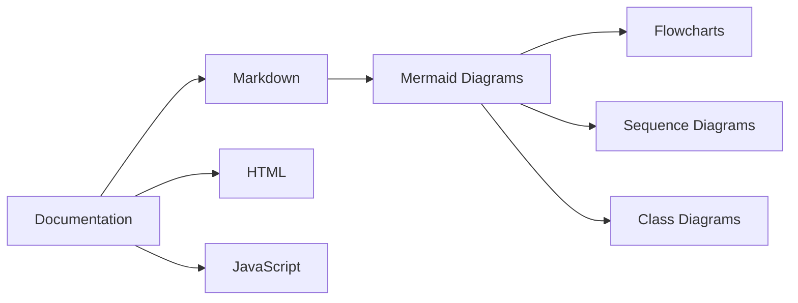

# Test Documentation

This is a test markdown file to demonstrate the docs server functionality.

## Features

- **Markdown rendering** with full support
- Syntax highlighting for code blocks
- Directory navigation
- File browsing
- **Mermaid diagram support** for flowcharts and diagrams

## Code Example

```javascript
function hello() {
  console.log("Hello, world!");
}
```

## Mermaid Diagram Example



## Links

- [Sample HTML file](./sample.html)
- [JavaScript example](./example.js)
- [Subdirectory](./subdirectory/)
- [Mermaid Diagram](./diagram.mermaid)
- [Sequence Diagram](./flowchart.mmd)